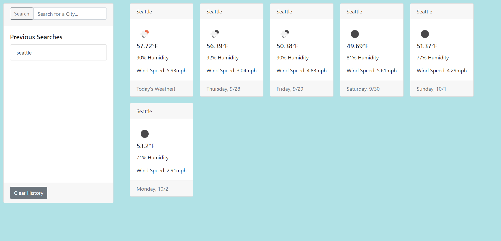

# Weather Forecast (5 Days)

## Description
Search any city in the world and see their weather in seconds!

## Table of Contents 
 * [Installation](#installation) 
 * [Usage](#usage) 
 * [Credits](#credits) 
 * [License](#license)  
 * [Questions](#questions)

## Installation
clone the repo and view index.html in a browser. Or visit here:

## Usage
Type a city in the search bar or click on previously searched cities to see them again!

## Credits
Openweather API

## License

This project is licensed under the MIT license. Click [here]([MIT](https://opensource.org/licenses/MIT)) for more information.

## License

## Questions 
 If you have further questions you can reach me at AveryJMyers@hotmail.com or visit my GitHub profile at github.com/AveryJMyers.
